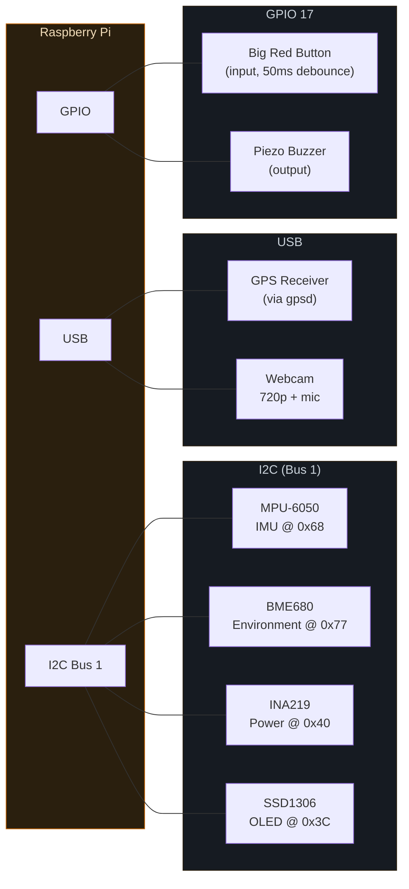
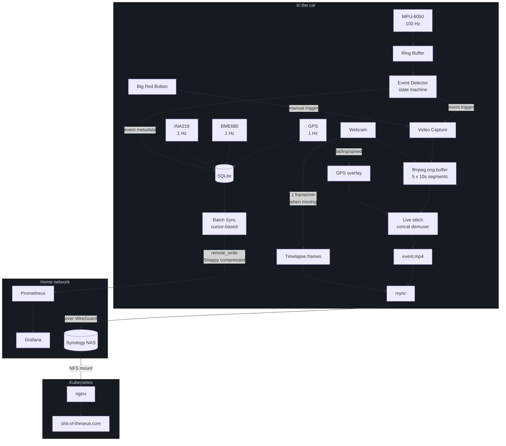

# shitbox

Rally car telemetry for the [Shitbox Rally 2026](https://www.shitboxrally.com.au/).
Port Douglas to Melbourne, 4000+ km, in a 2001 Ford Laser that owes us nothing.

All proceeds go to the [Cancer Council](https://short.albatrossflavour.com/Shitbox).

Live site: [shit-of-theseus.com](https://shit-of-theseus.com)

## What is this

A Raspberry Pi bolted to the dash of a $1000 car, running a Python daemon that
captures GPS, accelerometer data, engine bay environment, power draw, and video.
It detects driving events (hard braking, big corners, high G, rough road) in real
time, records dashcam footage with pre-roll, and syncs everything to Prometheus
over a WireGuard VPN when it can find signal. Which in outback Queensland is
not often.

The whole thing is offline-first. SQLite on disk, cursor-based batch sync,
rsync for video. If the network disappears for three days, it doesn't care.
It'll catch up.

## Hardware

- **Raspberry Pi** — the brains, running Raspbian, powered off the cigarette lighter
- **MPU-6050** — 6-axis IMU on I2C (0x68), 100 Hz sample rate, +/-4g accel, +/-500 deg/s gyro
- **USB GPS** — via gpsd, 1 Hz position/speed/altitude
- **BME680** — temperature, humidity, pressure, air quality on I2C (0x77)
- **INA219** — voltage/current/power monitor on I2C (0x40), watches the Pi's own draw
- **USB webcam** — 720p 30fps dashcam with audio
- **SSD1306 OLED** — 128x64 monochrome status display on I2C (0x3C)
- **Big red button** — arcade button on GPIO 17, manual capture trigger
- **Piezo buzzer** — chirps on event capture so you know it's working

## Wiring



## Data flow



## How it works

One daemon, three paths running concurrently:

**High-rate (100 Hz):** IMU samples feed a ring buffer. A state machine watches
for threshold crossings — hard brake, big corner, high G, rough road. When it
triggers, it grabs the pre-event data and kicks off video capture.

**Low-rate (1 Hz):** GPS, environment, and power readings go straight to SQLite
(WAL mode, write-locked, thread-safe). Offline-first. Everything hits disk
before it hits the network.

**Capture:** The webcam runs a continuous ring buffer via ffmpeg — 10-second
segments, last 5 kept on disk. When an event fires (or someone hits the big red
button), the system grabs the pre-roll segments and records another 30 seconds
post-event. These get live-stitched with ffmpeg's concat demuxer — no
re-encoding, just muxing — into a single MP4 with a GPS/speed overlay baked in.

**Timelapse:** Separately, a frame gets grabbed every 60 seconds when the car's
moving above 5 km/h. End of day, they're assembled into a timelapse.

**Sync:** When the Pi sees the Prometheus host over WireGuard, a batch sync
service reads from a cursor position in SQLite and writes to Prometheus via
remote_write with Snappy compression. Video and event JSON get rsynced to a NAS
back home. The website serves them from an NFS mount. No cloud, no S3, just a
Synology in a cupboard.

## The OLED

Tiny screen on the dash, 4 lines:

```
GPS:5sat      45km/h
1.2g    EVT:12   REC
IMU  ENV  PWR
NET  BKL:0    52C
```

Failed sensors go inverted (white on black) so you can see something's broken
without SSH-ing into the car at 110 km/h.

## Project layout

```
src/shitbox/
  events/
    engine.py        # main daemon, orchestrates everything
    detector.py      # event detection state machine
    ring_buffer.py   # circular buffer for pre-event IMU data
    sampler.py       # high-rate MPU6050 reader
  collectors/        # GPS, IMU, environment, power (1 Hz each)
  capture/
    video.py         # ffmpeg subprocess wrapper
    button.py        # GPIO button with debounce
  display/
    oled.py          # SSD1306 status display
  storage/
    database.py      # SQLite with WAL, thread-safe writes
  sync/
    batch_sync.py    # cursor-based Prometheus remote_write
    connection.py    # network connectivity monitor
  utils/
    config.py        # YAML -> nested dataclasses
config/
  config.yaml        # the one config file
scripts/
  install.sh         # sets up the Pi from scratch
  trigger-capture.sh # manual capture via SIGUSR1
systemd/
  shitbox-telemetry.service
grafana/
  dashboards/        # Grafana dashboard JSON
```

## Installation

On the Pi:

```bash
git clone git@github.com:albatrossflavour/shitbox.git
cd shitbox
sudo ./scripts/install.sh
```

This enables I2C, installs gpsd, creates a venv, installs the package, drops
the systemd unit in place, and copies the default config to `/etc/shitbox/`.

Edit `/etc/shitbox/config.yaml` to taste, then:

```bash
sudo reboot  # for I2C and GPIO group changes
sudo systemctl start shitbox-telemetry
journalctl -u shitbox-telemetry -f
```

## Development

```bash
pip install -e ".[dev]"
pytest
ruff check src/
mypy src/
```

Dev happens on a laptop. Don't try to `pip install` on the Pi outside the
venv — you'll have a bad time.

## Config

Everything is in `config/config.yaml`. Flat YAML, loaded into nested
dataclasses. The interesting bits:

- `sync.uplink_enabled` — master switch. Set `false` when going properly offline.
- `capture.video_buffer` — ring buffer settings (segment length, count, overlay toggle)
- `capture.video.audio_device` — set to the webcam mic. Falls back to video-only if unavailable.
- `sensors.*` — enable/disable individual sensors. The system runs with whatever's available.

## The website

The live site at [shit-of-theseus.com](https://shit-of-theseus.com) is a
single-file HTML SPA served by nginx in Kubernetes, deployed via Flux. Events
and video are rsynced from the Pi to a NAS, NFS-mounted into the nginx pod.
No database, no API, no build step. Just `events.json` and MP4 files.

Source for the site is in a separate repo
([home-ops](https://github.com/albatrossflavour/home-ops)).

## Why "Shit of Theseus"

If you replace every part of a ship one at a time, is it still the same ship?

Same question, but with a Ford Laser, and the parts are head gaskets and
radiator hoses.

## License

MIT. Do what you want with it.
